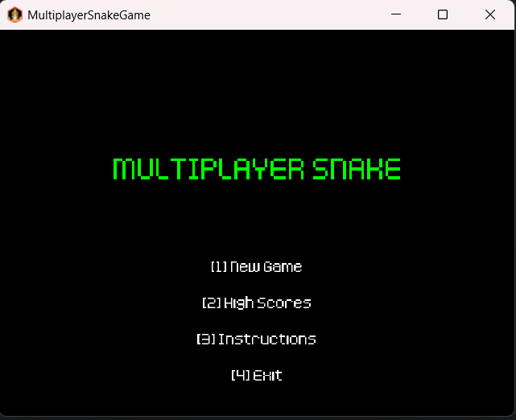
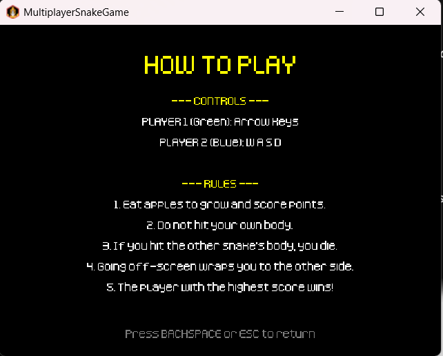
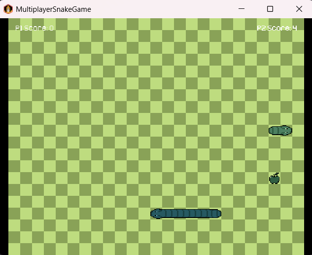
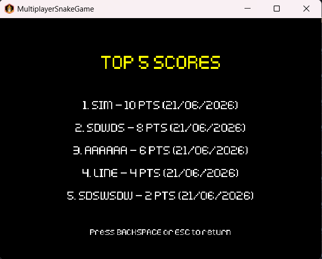
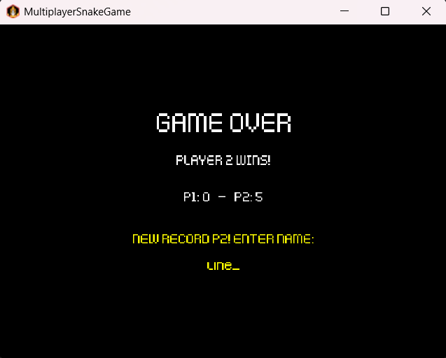
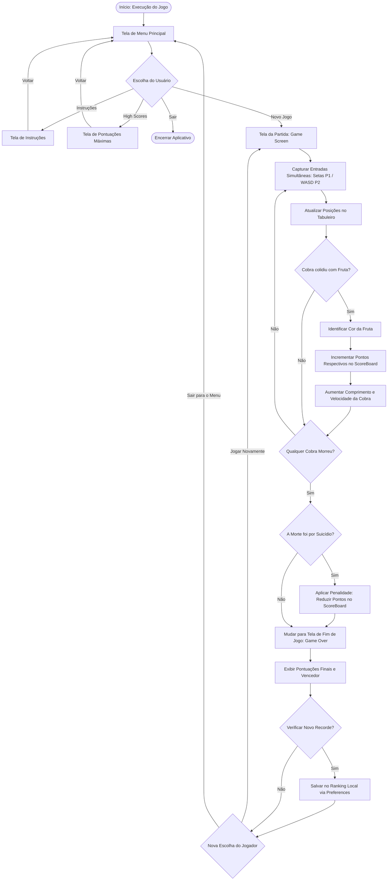

# 🐍MultiplayerSnakeGame🐍 - Jogo multiplayer baseado no Snake Game


---

# 👥Integrantes

| Nome | NUSP |
|---|---|
| Aline Mayumi Uekita | 16983070 |
| Anna Vitória Rocha Gonçalves | 14558885 |
| Higor Campos Fernandes | 15583489 |

---

# 🐍 Sobre o Jogo

O **Multiplayer Snake Game** é um jogo arcade competitivo para dois jogadores, baseado no clássico *Snake Game*, desenvolvido em **Java** utilizando o framework **LibGDX**.

O projeto foi construído dividindo a mesma tela (*local co-op*), onde os jogadores competem simultaneamente em tempo real para ver quem domina o tabuleiro e alcança a maior pontuação.

---

## 🎮 Mecânicas e Controles

O sistema divide o gerenciamento e o controle das entidades de forma independente:

* **🟢 Jogador 1 (Cobra Verde):** Controlado de forma intuitiva através das **setas direcionais** do teclado.
* **🔵 Jogador 2 (Cobra Azul):** Controlado simultaneamente através das teclas **`W`**, **`A`**, **`S`** e **`D`**.

---

## ⚡ Funcionalidades Principais

* 🍎 **Sistema de Frutas Dinâmico:** Frutas de cores distintas surgem aleatoriamente pelo cenário. Cada cor corresponde a uma pontuação e recompensa diferente ao ser consumida.
* 💾 **Placar com Memória Local:** Armazenamento persistente das maiores pontuações (*High Scores*), garantindo a competição mesmo após o jogo ser fechado.
* ⚖️ **Mecânica Antisuicídio (Equilíbrio):** A partida se encerra quando qualquer uma das cobras morre. Contudo, se um jogador causar a própria morte intencionalmente para congelar o placar, o sistema aplica uma severa **penalidade de pontos** na sua pontuação final.
* 🖼️ **Gráficos Responsivos:** Ajuste automático de resolução de tela que preserva a proporção dos elementos visuais sem distorcer o grid do jogo.

---

## 🛠️ Tecnologias Utilizadas

O projeto foi estruturado utilizando ferramentas modernas para o ecossistema Java de jogos:

* **Java:** Linguagem base para toda a lógica de Programação Orientada a Objetos (POO).
* **LibGDX:** Framework multimídia para o gerenciamento de telas, texturas, inputs e o ciclo de vida do *Game Loop*.
* **Gradle / Gdx-Liftoff:** Ferramentas utilizadas para a gerência de dependências e setup modular do projeto.

---

# 📋 Requisitos 
O sistema foi desenvolvido para atender aos seguintes requisitos gerais de funcionamento e jogabilidade:

* **Configuração e Interface:** Funcionar como uma aplicação desktop via LibGDX, dispondo de menu principal interativo, tela de instruções clara e tela de encerramento (*Game Over*).
* **Mecânicas de Movimentação:** Controlar duas cobras simultâneas em um tabuleiro do tipo *pac-man* (onde as bordas se conectam), com crescimento progressivo e aceleração a cada item consumido.
* **Sistema de Colisões:** Detectar colisões fatais da cobra contra o próprio corpo ou contra a cobra adversária para determinar o fim da partida.
* **Suporte Multijogador Independente:** Diferenciar os jogadores por cores exclusivas e mapear controles isolados (Setas direcionais vs. Teclas WASD) no mesmo teclado.
* **Feedback Sonoro e Visual:** Exibir um placar dinâmico em tempo real e reproduzir efeitos sonoros para eventos críticos, como consumo de alimentos e mortes.
* **Persistência de Dados (Ranking):** Salvar e carregar localmente um histórico com as 5 maiores pontuações (*High Scores*), disponibilizando uma tela de recordes no menu principal.
* **Equilíbrio e Variedade (Opcionais):** Implementar frutas especiais com pontuações distintas e um sistema de penalização de pontos para coibir o suicídio proposital de jogadores.

As funcionalidades específicas que implementam esses requisitos estão detalhadas logo abaixo, na seção **⚡ Funcionalidades Principais**.

---

# 🖥️ Interfaces do Jogo

A interface visual do jogo foi desenvolvida utilizando o motor gráfico do **LibGDX**, estruturada através do gerenciamento de telas (`Screen`) e renderização de textos via *BitmapFont* para garantir uma navegação fluida e responsiva.

As capturas de tela abaixo representam as principais interfaces que guiam os usuários desde a inicialização até o encerramento das partidas.

---

# 📷 Demonstração das Interfaces

## Menu Principal



*Apresenta o título do jogo e fornece os pontos de entrada para iniciar a partida, visualizar as instruções, conferir as pontuações máximas ou encerrar o aplicativo.*

---

## 📖 Tela de Instruções (Como Jogar)



*Explicita as regras de pontuação, o funcionamento das bordas conectadas, o sistema de penalidades por suicídio e o mapeamento dos controles (Setas para o Jogador 1 e WASD para o Jogador 2).*

---

## 🎮 Tela da Partida (Ambiente do Jogo)



*O cenário ativo em tempo real onde o grid, as cobras (Verde e Azul), a geração dinâmica de frutas e o placar simultâneo no topo da tela são renderizados.*

---

## 🏆 Tela de Pontuações Máximas (High Scores)



*Exibe o painel de ranking local alimentado pela persistência de dados, mostrando o histórico das 5 melhores pontuações registradas.*

---

## 💀 Tela de Fim de Jogo (Game Over)



*Interface acionada no momento da colisão fatal. Exibe o resultado final de pontos de cada jogador, destaca o vencedor com as devidas penalidades aplicadas e oferece os botões de ação para "Jogar Novamente" ou "Sair".*

# Estrutura do Projeto

## 📂 Principais Classes

| Classe | Responsabilidade |
|---|---|
| `GameObject` | Classe abstrata base para todas as entidades renderizáveis do cenário. |
| `Snake` | Representa as cobras, gerenciando o corpo, tamanho, direção e lógica de movimento. |
| `Food` | Representa os itens consumíveis (frutas), controlando posições e valores de pontos. |
| `ScoreBoard` | Gerencia a pontuação ativa, penalidades e o histórico de recordes (*High Scores*). |
| `GameScreen` | Tela principal do jogo onde ocorre o *Game Loop* (entrada, física e renderização). |
| `MainMenuScreen`| Tela de menu inicial com opções de navegação do usuário. |
| `InstructionScreen`| Tela explicativa que apresenta as regras e o mapeamento dos controles. |
| `GameOverScreen`| Tela de encerramento que exibe o placar final e opções de reinicialização. |
| `SnakeGame` | Classe central (extensão de `Game`) que coordena a transição entre as telas. |
| `Lwjgl3Launcher`| Inicializador nativo desktop que configura e dispara a aplicação. |

---

# 🛠️ Conceitos de POO Aplicados

## 1️⃣ Herança

A classe abstrata `GameObject` (ou equivalente estrutural no seu projeto) foi utilizada como classe base para `Snake` e `Food`. Ela encapsula propriedades compartilhadas por elementos do cenário, como coordenadas posicionais (`x, y`) e dimensões, permitindo reutilização de código de forma limpa.

---

## 2️⃣ Encapsulamento

Os estados internos críticos — como a lista de segmentos que formam o corpo da cobra ou o mapa de pontuações do `ScoreBoard` — foram protegidos utilizando o modificador `private`. O acesso e a modificação desses dados ocorrem estritamente através de métodos públicos bem definidos (como `grow()`, `changeDirection()` e `addPoints()`), garantindo a integridade das regras do jogo.

---

## 3️⃣ Polimorfismo

Utilizado amplamente no ciclo de vida das telas através da interface `Screen` do LibGDX. As classes `MainMenuScreen`, `GameScreen` e `GameOverScreen` sobrescrevem o método `@Override render(float delta)` para implementar comportamentos de desenho e atualização lógica completamente distintos, embora todas sejam tratadas de forma genérica pela classe principal `SnakeGame`.

---

## 4️⃣ Abstração

A complexidade de renderização de baixo nível da GPU e a captura direta de eventos do teclado foram abstraídas pelas ferramentas do framework LibGDX. No escopo do projeto, as classes se concentram apenas nas regras de negócio essenciais da simulação arcade (como vetores de direção, detecção geométrica de colisões e controle de tempo do passo lógico).

---

## 5️⃣ Persistência de Dados

A persistência do ranking local foi implementada utilizando a classe nativa `Preferences` do LibGDX. Ela abstrai a escrita em arquivos físicos no sistema operacional, permitindo salvar e carregar as chaves de pontuação máxima no disco de maneira limpa e transparente ao usuário.

---

# Descrição geral do Jogo

## 📌 Fluxo Geral de Navegação e Mecânicas



---

# Comentários sobre o código

O projeto foi organizado seguindo o princípio da separação de responsabilidades e a arquitetura baseada em estados (telas) do framework LibGDX, o que facilita a manutenção do código, a reutilização de componentes e futuras expansões.

A classe central `SnakeGame` atua como a coordenadora principal do ciclo de vida do aplicativo, sendo a responsável por gerenciar a transição entre as diferentes telas do jogo através do método `setScreen`.

A camada visual e o fluxo do usuário foram divididos em classes de tela independentes: `MainMenuScreen` gerencia a interface inicial e navegação; `InstructionScreen` apresenta as diretrizes e mapeamento de comandos; `GameOverScreen` processa o desfecho da partida e opções de reinício; e a `GameScreen` concentra o coração da aplicação, encapsulando o *Game Loop* dinâmico (processamento de entradas do teclado, atualização da física e renderização gráfica).

As regras de negócio e a simulação do jogo são isoladas em entidades específicas do domínio. A classe `Snake` controla de forma autônoma a movimentação, crescimento e autocolisão de cada jogador. A classe `Food` gerencia a lógica de spawn aleatório e as propriedades nutricionais (pontuação) das frutas no tabuleiro.

O gerenciamento de estado técnico, feedback e persistência foi distribuído em módulos especializados:
* `ScoreBoard`: Centraliza o controle de pontuação simultânea, aplica as penalidades de pontos em caso de suicídio e manipula a API `Preferences` do LibGDX para ler e gravar o ranking das 5 melhores pontuações em um arquivo local permanente.
* **Gerenciamento de Áudio e Assets**: Os efeitos sonoros (como o som de mordida ao consumir frutas e o som de impacto na colisão) e a trilha sonora de fundo são manipulados de forma otimizada pelas classes nativas `Sound` e `Music`. Isso garante o carregamento assíncrono e a execução fluida do áudio em tempo real, sem interromper ou travar os frames de renderização.

A arquitetura adotada busca manter um baixo acoplamento entre a renderização gráfica e a lógica matemática das colisões, garantindo alta coesão dentro de cada entidade e respeitando as boas práticas de Programação Orientada a Objetos aplicada ao desenvolvimento de jogos.

---

# 🚀 Desafios Técnicos e Soluções

Durante o desenvolvimento do projeto, a equipe enfrentou diversas adversidades na integração de mecânicas com o framework **LibGDX**. Abaixo estão mapeados os principais desafios e como foram superados:

### 🔤 1. Renderização de Fontes
* **O Desafio:** Encontrar uma tipografia compatível que mantivesse a estética arcade sem distorcer as letras.
* **A Solução:** Implementamos a fonte pixelada personalizada `Kenney Pixel.ttf`, processada e desenhada dinamicamente em tempo real em menus e textos através da classe `BitmapFont`.

### ⚔️ 2. Sistema de Colisões Simultâneas
* **O Desafio:** Tratar de forma limpa e eficiente a física de colisão simultânea de múltiplos elementos se movendo na grade.
* **A Solução:** Estruturamos dois ciclos (*loops*) de verificação paralelos:
  1. **Autocolisão:** Validação posicional da cabeça da cobra com seus próprios segmentos anteriores.
  2. **Colisão Cruzada:** Validação posicional contínua entre a cabeça da cobra de um jogador contra toda a extensão da cobra adversária.

### 💾 3. Persistência do Placar (High Scores)
* **O Desafio:** Garantir que o histórico competitivos com os recordes não fosse apagado ao fechar o executável.
* **A Solução:** Criamos o componente `ScoreBoard`, integrado à API nativa `Preferences` do LibGDX. O sistema intercepta o fim do jogo, valida se houve novo recorde e faz a gravação persistente em um arquivo de configuração local no disco.

### 🖼️ 4. Responsividade e Proporção Visual
* **O Desafio:** Ajustar ou redimensionar a janela do jogo de forma flexível sem esticar as texturas ou quebrar o alinhamento do grid matemático do tabuleiro.
* **A Solução:** Isolamos o gerenciamento de renderização aplicando o conceito de `Viewport` do LibGDX, o que força a proporção de tela correta independente do monitor, adicionando barras pretas (*letterboxing*) de forma limpa se necessário.

---
# 🧪 Testes Automatizados (JUnit 5)
### 1. Plano de Testes
O plano de testes visa validar a lógica central do jogo de forma isolada, garantindo que as regras de negócio funcionem independentemente do motor gráfico. Utilizamos o framework **JUnit 5** para a implementação da suíte de testes.

* **Validação de Fronteiras (WorldBoundsTests):** Testa a lógica de *wrapping* (teletransporte nas bordas).
    * *Objetivo:* Verificar se coordenadas que excedem o limite da grade (20x20) são corretamente mapeadas para o lado oposto.
* **Testes de Regras de Negócio (FoodTests):** Valida a alteração de estados da classe `Food`.
    * *Objetivo:* Garantir que `respawnAs` aplique corretamente os modificadores de pontuação e tamanho para maçãs douradas e podres.
* **Simulação de Ciclo de Vida (SnakeDigestionTests):** Valida o comportamento da `Snake` ao processar penalidades.
    * *Objetivo:* Confirmar se, ao consumir uma maçã podre, a cobra encolhe corretamente até o limite mínimo de 2 segmentos, protegendo a integridade do estado da entidade.

### 2. Resultados dos Testes
A execução dos testes é integrada ao ciclo de vida do Gradle. Abaixo, o output gerado pela suíte de testes no ambiente de desenvolvimento:

```text
> Task :core:test

SnakeGameLogicTests > testWorldBoundsWrapping() PASSED
SnakeGameLogicTests > testFoodTypesAndModifiers() PASSED
SnakeGameLogicTests > testSnakeDigestionLogic() PASSED

BUILD SUCCESSFUL in 1.2s
```
Além da confirmação via terminal, o Gradle gera um relatório detalhado em HTML em: core/build/reports/tests/test/index.html.

# 🛠️ Como Compilar e Executar o Jogo

Siga os passos abaixo para baixar, compilar e executar o projeto diretamente na sua máquina local:

### 1. Clonar o Repositório
Abra o seu terminal e execute o comando abaixo para clonar o projeto:
```bash
git clone [https://github.com/AnnaVrg/SCC0204---Multiplayer-Snake-Game.git](https://github.com/AnnaVrg/SCC0204---Multiplayer-Snake-Game.git)

```

### 2. Acessar o Diretório

Navegue até a pasta raiz do repositório que foi clonado: 
```bash
cd SCC0204---Multiplayer-Snake-Game 
```

### 3. Compilar e Executar o Projeto
Certifique-se de estar no diretório raiz e rode o comando de inicialização correspondente ao seu sistema operacional/terminal

```bash
./gradlew lwjgl3:run
```

---
# 📝 Comentários Gerais

O desenvolvimento deste projeto permitiu aplicar de forma prática diversos conceitos fundamentais estudados na disciplina de Programação Orientada a Objetos (POO), incluindo encapsulamento, herança, abstração, polimorfismo e a organização modular de código voltada para a arquitetura de jogos.

Além do aprendizado técnico conceitual, o trabalho proporcionou uma experiência valiosa no desenvolvimento colaborativo e na separação rigorosa de responsabilidades entre componentes, gerenciando de forma eficiente um *Game Loop* síncrono que dita o ritmo da simulação e das mecânicas em tempo real.

Um aspecto altamente relevante do projeto foi lidar com os desafios de infraestrutura e compatibilidade de plataformas no ecossistema **LWJGL3/LibGDX**. A implementação de rotinas auxiliares de inicialização (como o tratamento de concorrência de *threads* nativas) garantiu que o jogo rodasse perfeitamente e sem travamentos em diferentes sistemas operacionais (Windows, Linux e macOS), mantendo taxas de quadros estáveis e respostas de comandos imediatas para ambos os jogadores.

A estrutura baseada em estados de tela (`Screen`) e entidades isoladas torna o sistema facilmente expansível. Isso permite, em futuras iterações, a adição de novos modos de jogo (como partidas online via *WebSockets*), inserção de novos tipos de obstáculos dinâmicos no tabuleiro ou integração com bancos de dados remotos para um ranking global de *High Scores*, tudo isso sem a necessidade de reestruturar a arquitetura existente.
